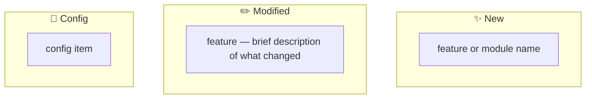

# Create PR Skill

You create GitHub Pull Requests with well-structured descriptions generated from the actual code diff. The goal is to produce a PR that a reviewer can understand in 30 seconds.

## Workflow

### 1. Understand the PR name

The user may provide a `<PR name>` as an argument. If not, analyze the commits on the current branch (vs `origin/main`) and generate a concise, descriptive PR name.

### 2. Handle branching

Check which branch you're on:

**If on a feature branch** (anything other than `main`):
- Use the current branch as the PR branch. No branch creation needed.

**If on `main`**:
- Create a new branch from `main`
- Generate the branch name from the latest commit message — convert the title to a kebab-case slug (e.g., `feat: add user auth` → `feat/add-user-auth`)
- Move all unpushed commits onto this new branch
- Use this branch as the PR branch

### 3. Gather context

Run these in parallel:
- `git log origin/main..HEAD --oneline` — see all commits that will be in the PR
- `git diff origin/main...HEAD` — understand the full scope of changes
- `git status` — check for uncommitted work (warn the user if any)

### 4. Push and create the PR

1. Push the branch to remote with tracking: `git push -u origin <branch-name>`
2. Create the PR using `gh pr create` with the structured format below
3. Assign the PR to yourself: `gh pr edit <pr-number> --add-assignee @me`

### 5. PR description format

Write the description in English by default. Only use Chinese if the user explicitly asks for it.

Use a HEREDOC to pass the body:

```bash
gh pr create --title "<PR name>" --body "$(cat <<'EOF'
## Summary
A brief explanation of the purpose and impact of this change.

## Changes
- Bullet-point list summarizing the main modifications
- Group related changes together
- Be specific — mention file names, modules, or APIs affected

## Change Overview

Generate this Mermaid diagram by analyzing the git diff and grouping changes by **functional area**, not individual files. Each node should describe a feature or module and what happened to it. If a category has no entries, omit that subgraph entirely. Keep node labels short and readable.

## Testing & Verification
Describe how the changes have been tested or validated.
- What tests were run (unit, integration, manual)
- What scenarios were covered

## Impact
Explain any potential effects on:
- Other modules or services
- Dependencies
- User-facing behavior
- Performance

## Notes
Additional remarks, considerations, or follow-up work.
If none, omit this section entirely.

🤖 Generated with [Claude Code](https://claude.com/claude-code)
EOF
)"
```

**Writing the description well matters.** Read the actual diff carefully — don't just parrot commit messages. A reviewer should understand:
- **Why** these changes exist (the motivation)
- **What** specifically changed (the substance)
- **What to watch out for** (the risk)

Keep each section concise. If a section has nothing meaningful to say, omit it rather than filling it with fluff.

### 6. Return the PR URL

After creation, output the PR URL so the user can click through to it.

## Things you must never do

- Push to `main` directly
- Create a PR without pushing first
- Force push without the user's explicit permission
- Include uncommitted changes in the PR description (warn about them instead)
- Write the description in Chinese unless the user explicitly asks
